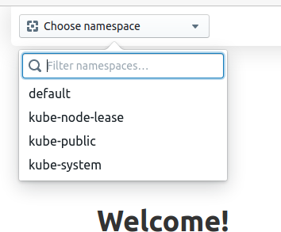
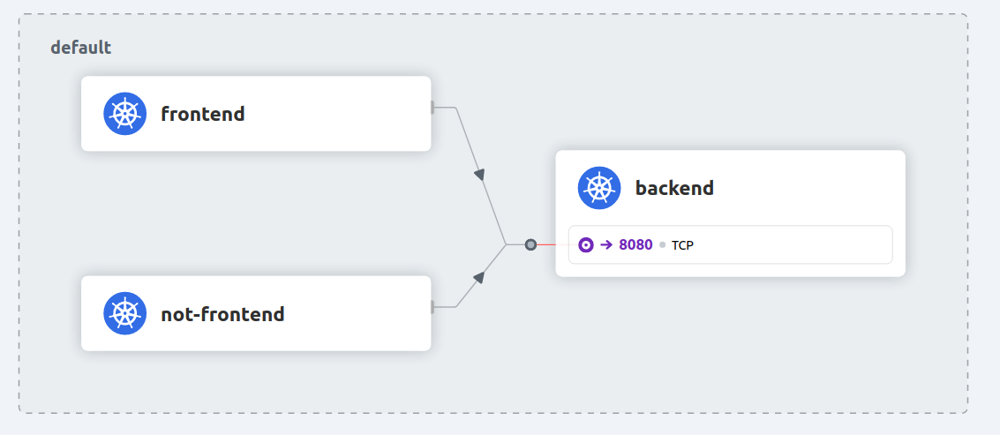
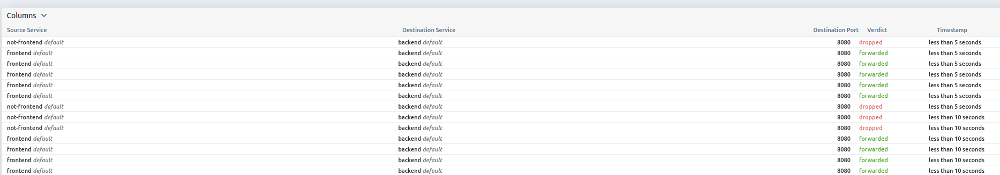
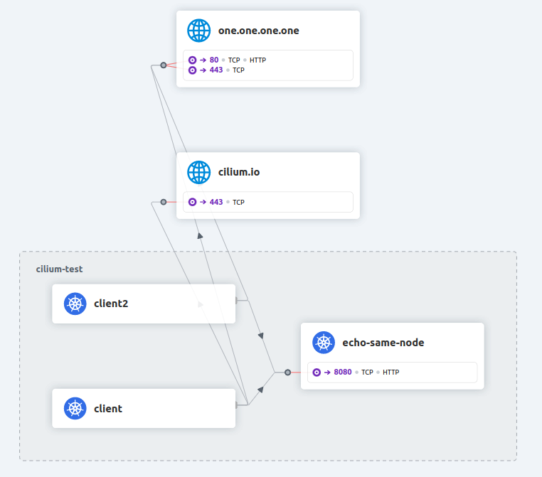
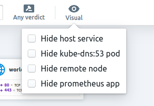

Not only does Hubble allow us to inspect flows from the command line, but it also allows us to see them in real-time on a graphical service map via Hubble UI. Again, this also is an optional component that is disabled by default.


## {} Enable the Hubble UI component

Enabling the optional Hubble UI component with Helm looks like this:

```bash
helm upgrade -i cilium cilium/cilium --version {} \
  --namespace kube-system \
  --set ipam.operator.clusterPoolIPv4PodCIDRList={10.1.0.0/16} \
  --set cluster.name=cluster1 \
  --set cluster.id=1 \
  --set operator.replicas=1 \
  --set upgradeCompatibility=1.11 \
  --set kubeProxyReplacement=disabled \
  --set hubble.enabled=true \
  --set hubble.relay.enabled=true \
  `# enable hubble ui variable:` \
  --set hubble.ui.enabled=true \
  --wait
```

{}
When using the `cilium` CLI, you can execute the following command to enable the Hubble UI:

```
# cilium hubble enable --ui
```
{}

Take a look at the pods again to see what happened under the hood:

```bash
kubectl get pods -A
```

We see, there is again a new Pod running for the `hubble-ui` component.

```
NAMESPACE     NAME                               READY   STATUS    RESTARTS       AGE
default       backend-6f884b6495-v7bvt           1/1     Running   0              94m
default       frontend-77d99ffc5d-lcsph          1/1     Running   0              94m
default       not-frontend-7db9747986-snjwp      1/1     Running   0              94m
kube-system   cilium-ksr7h                       1/1     Running   0              102m
kube-system   cilium-operator-6f5c6f768d-r2qgn   1/1     Running   0              102m
kube-system   coredns-6d4b75cb6d-nf8wz           1/1     Running   0              115m
kube-system   etcd-cluster1                      1/1     Running   0              115m
kube-system   hubble-relay-84b4ddb556-nr7c8      1/1     Running   0              93m
kube-system   hubble-ui-579fdfbc58-578g9         2/2     Running   0              19s
kube-system   kube-apiserver-cluster1            1/1     Running   0              115m
kube-system   kube-controller-manager-cluster1   1/1     Running   0              115m
kube-system   kube-proxy-7l6qk                   1/1     Running   0              115m
kube-system   kube-scheduler-cluster1            1/1     Running   0              115m
kube-system   storage-provisioner                1/1     Running   1 (115m ago)   115m
```

Cilium agents are restarting, and a new Hubble UI Pod is now present on top of the Hubble Relay pod. As above, we can wait for Cilium and Hubble to be ready by running:

```bash
cilium status --wait
```

```
cilium status --wait
    /¯¯\
 /¯¯\__/¯¯\    Cilium:         OK
 \__/¯¯\__/    Operator:       OK
 /¯¯\__/¯¯\    Hubble:         OK
 \__/¯¯\__/    ClusterMesh:    disabled
    \__/

Deployment        hubble-relay       Desired: 1, Ready: 1/1, Available: 1/1
Deployment        cilium-operator    Desired: 1, Ready: 1/1, Available: 1/1
Deployment        hubble-ui          Desired: 1, Ready: 1/1, Available: 1/1
DaemonSet         cilium             Desired: 1, Ready: 1/1, Available: 1/1
Containers:       cilium             Running: 1
                  hubble-ui          Running: 1
                  hubble-relay       Running: 1
                  cilium-operator    Running: 1
Cluster Pods:     6/6 managed by Cilium
Image versions    cilium             quay.io/cilium/cilium:v1.12.1:: 1
                  hubble-ui          quay.io/cilium/hubble-ui:v0.9.1: 1
                  hubble-ui          quay.io/cilium/hubble-ui-backend:v0.9.1: 1
                  hubble-relay       quay.io/cilium/hubble-relay:v1.12.1: 1
                  cilium-operator    quay.io/cilium/operator-generic:v1.12.1: 1
```


And then check Hubble status:

```bash
hubble status
```

{}
Our earlier command kubectl port-forward should still be running (can be checked by running jobs or `ps aux | grep "port-forward"`). If it does not, Hubble status will fail and we have to run it again:

```bash
cilium hubble port-forward&
hubble status
```

{}


To start Hubble UI execute

```bash
kubectl port-forward -n kube-system --address 0.0.0.0 svc/hubble-ui 12000:80 &
```

In our Webshell environment you can use the public IP of the VM to access Hubble. A simple way is to execute

```bash
echo "http://$(curl -s ifconfig.me):12000"
```
and copy the output in a new browser tab. If you are working locally, the browser should open http://localhost:12000/ (open it manually if not).

We can then access the graphical service map by selecting our `default` Namespace:



If you see a spinning circle and the message "Waiting for service map data..." you can generate some network activity again:

```bash
for i in {1..10}; do
  kubectl exec -ti ${FRONTEND} -- curl -I --connect-timeout 5 backend:8080
  kubectl exec -ti ${NOT_FRONTEND} -- curl -I --connect-timeout 5 backend:8080
done
```

and then you should see a service map in the Hubble UI



and also a table with the already familiar flow output previously seen in the `hubble observe` command:



Hubble flows are displayed in real-time at the bottom, with a visualization of the namespace objects in the center. Click on any flow, and click on any property from the right-side panel: notice that the filters at the top of the UI have been updated accordingly.

Let's run a connectivity test again and see what happens in Hubble UI in the `cilium-test` namespace. In the Hubble UI dropdown change to `cilium-test`. Since this test runs for a few minutes this could be a good time to grab a :coffee:.

```bash
cilium connectivity test --test 'client-egress-to-echo-service-account' --test to-entities-world --test to-fqdns
```

We can see that Hubble UI is not only capable of displaying flows within a Namespace, it also helps visualize flows going in or out of it.



And there are also several visual options in the Hubble UI:



Once done, clean up the connectivity test Namespace again:

```bash
kubectl delete ns cilium-test --wait=false
```
