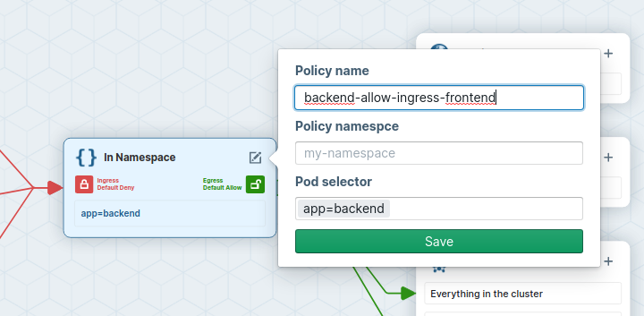

## Network Policies

One of the most basic CNI functions is the ability to enforce network policies and implement an in-cluster zero-trust container strategy. Network policies are a default Kubernetes object for controlling network traffic, but a CNI such as Cilium is required to enforce them. Let's deploy a very simple application to demonstrate how it works.

{}
If you are not yet familiar with Kubernetes Network Policies we suggest to go to the [Kubernetes Documentation](https://kubernetes.io/docs/concepts/services-networking/network-policies/)
{}


## Task {}.1: Deploy simple application

Let's have a look at the following resource definitions:



The application consists of two client deployments (`frontend` and `not-frontend`) and one backend deployment (`backend`). We are going to send requests from the frontend and not-frontend pods to the backend pod.

Deploy the app:

```bash
kubectl create -f simple-app.yaml
```

Verity with with the following command that everything is up and running:

```bash
kubectl get all
```

```
NAME                                READY   STATUS              RESTARTS   AGE
pod/backend-56787b4bd7-dmzdh        0/1     ContainerCreating   0          6s
pod/frontend-7cbdcb86fd-gdb4q       0/1     ContainerCreating   0          6s
pod/not-frontend-5cf6d96558-gj4np   0/1     ContainerCreating   0          6s

NAME                 TYPE        CLUSTER-IP       EXTERNAL-IP   PORT(S)    AGE
service/backend      ClusterIP   10.106.244.233   <none>        8080/TCP   6s
service/kubernetes   ClusterIP   10.96.0.1        <none>        443/TCP    36m

NAME                           READY   UP-TO-DATE   AVAILABLE   AGE
deployment.apps/backend        0/1     1            0           6s
deployment.apps/frontend       0/1     1            0           6s
deployment.apps/not-frontend   0/1     1            0           6s

NAME                                      DESIRED   CURRENT   READY   AGE
replicaset.apps/backend-56787b4bd7        1         1         0       6s
replicaset.apps/frontend-7cbdcb86fd       1         1         0       6s
replicaset.apps/not-frontend-5cf6d96558   1         1         0       6s

```


## Task {}.2: Cilium Endpoint

Each Pod from our application will be represendet in Cilium as an [Endpoint](https://docs.cilium.io/en/stable/concepts/terminology/#endpoint). We can use the `cilium` tool inside a Cilium pod to list them.

First get all Cilium pods with:

```bash
kubectl -n kube-system get pods -l k8s-app=cilium
```

```NAME           READY   STATUS    RESTARTS        AGE
cilium-mvh65   1/1     Running   1 (6h26m ago)   6h30m
```

and then run:

```bash
kubectl -n kube-system exec <podname> -- cilium endpoint list
```

{}
Or you can also use some jsonpath magic and execute the command in one line:

```bash
kubectl -n kube-system exec $(kubectl -n kube-system get pods -l k8s-app=cilium -o jsonpath='{.items[0].metadata.name}') -- cilium endpoint list
```
{}

Both ingress and egress policy enforcement is still disabled on all of these pods because no network policy has been imported yet which select any of the pods.


## Task {}.3: Verify connectivity

In Kubernetes, all traffic is allowed by default. So let's check connectivity between pods.

Let's make life a bit easier by storing the Pod's name into an environment variable so we can reuse it later again:

```bash
FRONTEND=$(kubectl get pods -l app=frontend -o jsonpath='{.items[0].metadata.name}')
echo ${FRONTEND}
NOT_FRONTEND=$(kubectl get pods -l app=not-frontend -o jsonpath='{.items[0].metadata.name}')
echo ${NOT_FRONTEND}
```

Then execute:

```bash
kubectl exec -ti ${FRONTEND} -- curl -I --connect-timeout 5 backend:8080
kubectl exec -ti ${NOT_FRONTEND} -- curl -I --connect-timeout 5 backend:8080
```

This will execute a simple `curl` call from the `frontend` and `not-frondend` application to the `backend` application:

```
# Frontend
HTTP/1.1 200 OK
X-Powered-By: Express
Vary: Origin, Accept-Encoding
Access-Control-Allow-Credentials: true
Accept-Ranges: bytes
Cache-Control: public, max-age=0
Last-Modified: Sat, 26 Oct 1985 08:15:00 GMT
ETag: W/"83d-7438674ba0"
Content-Type: text/html; charset=UTF-8
Content-Length: 2109
Date: Tue, 23 Nov 2021 12:50:44 GMT
Connection: keep-alive

# Not Frontend
HTTP/1.1 200 OK
X-Powered-By: Express
Vary: Origin, Accept-Encoding
Access-Control-Allow-Credentials: true
Accept-Ranges: bytes
Cache-Control: public, max-age=0
Last-Modified: Sat, 26 Oct 1985 08:15:00 GMT
ETag: W/"83d-7438674ba0"
Content-Type: text/html; charset=UTF-8
Content-Length: 2109
Date: Tue, 23 Nov 2021 12:50:44 GMT
Connection: keep-alive
```

and we see, both applications can connect to the `backend` application.


## Task {}.4: Disallow traffic with a Network Policy

Let's disallow traffic by applying a network policy:



The policy will deny all ingress traffic as it is of type Ingress but specifies no allow rule, and will be applied to all pods with the `app=backend` label thanks to the podSelector.

Ok, then let's create the policy with:

```bash
kubectl apply -f backend-ingress-deny.yaml
```

and you can verify the created Network Policy with:

```bash
kubectl get netpol
```

which gives you an output similar to this:

```
                                                    
NAME                   POD-SELECTOR   AGE
backend-ingress-deny   app=backend    2s

```


## Task {}.5: Verify connectivity again

We can now execute the connectivty check again:

```bash
kubectl exec -ti ${FRONTEND} -- curl -I --connect-timeout 5 backend:8080
kubectl exec -ti ${NOT_FRONTEND} -- curl -I --connect-timeout 5 backend:8080
```

but this time you see that the `frontend` and `not-frontend` application cannot connect anymore to the `backend`:

```
# Frontend
curl: (28) Connection timed out after 5001 milliseconds
command terminated with exit code 28
# Not Frontend
curl: (28) Connection timed out after 5001 milliseconds
command terminated with exit code 28
```

The network policy correctly switched the default ingress behavior from default allow to default deny. Let's now selectively re-allow traffic again, but only from frontend to backend.


## Task {}.6: Allow traffic from frontend to backend

We can do it by crafting a new network policy manually, but we can also use the Network Policy Editor to help us out:

* Go to https://networkpolicy.io/editor.
* Upload our initial backend-ingress-deny policy.


* Rename the network policy to backend-allow-ingress-frontend (using the Edit button in the center).



* On the ingress side, add `app=frontend` as podSelector for pods in the same namespace.


* Inspect the ingress flow colors: the policy will deny all ingress traffic to pods labelled `app=backend`, except for traffic coming from pods labelled `app=frontend`.


* Download the policy YAML file.

The file should look like this:



Apply the new policy:

```bash
kubectl create -f backend-allow-ingress-frontend.yaml
```

and then execute the connectivity test again:

```bash
kubectl exec -ti ${FRONTEND} -- curl -I --connect-timeout 5 backend:8080
kubectl exec -ti ${NOT_FRONTEND} -- curl -I --connect-timeout 5 backend:8080
```

This time, the `frontend` application is able to connect to the `backend` but the `not-frontend` application still cannot connect to the `backend`:

```
# Frontend
HTTP/1.1 200 OK
X-Powered-By: Express
Vary: Origin, Accept-Encoding
Access-Control-Allow-Credentials: true
Accept-Ranges: bytes
Cache-Control: public, max-age=0
Last-Modified: Sat, 26 Oct 1985 08:15:00 GMT
ETag: W/"83d-7438674ba0"
Content-Type: text/html; charset=UTF-8
Content-Length: 2109
Date: Tue, 23 Nov 2021 13:08:27 GMT
Connection: keep-alive

# Not Frontend
curl: (28) Connection timed out after 5001 milliseconds
command terminated with exit code 28

```

Note that this is working despite the fact we did not delete the previous `backend-ingress-deny` policy:

```bash
kubectl get netpol
```

```
NAME                             POD-SELECTOR   AGE
backend-allow-ingress-frontend   app=backend    2m7s
backend-ingress-deny             app=backend    12m

```

Network policies are additive. Just like with firewalls, it is thus a good idea to have default DENY policies and then add more specific ALLOW policies as needed.


## Task {}.7: Inspecting the cilium endpoints again

We can now check the cilium endpoints again. First get all Cilium pods with:

```bash
kubectl -n kube-system exec <podname> -- cilium endpoint list
```

And now we see that the pods with the label `app=backend` now have ingress policy enforcement enabled.
