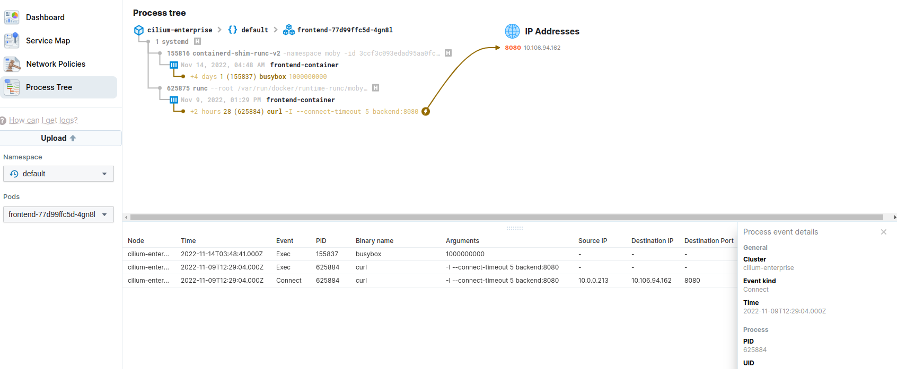

## {} Enable Process Visibility


Edit your cilium-enterprise-values.yaml file so that it reads:

```yaml
cilium:
  (...)
hubble-enterprise:
  enabled: true
  enterprise:
    enabled: true
  (...)
```

Then, run `helm upgrade` command to apply the new configuration:

```bash
helm upgrade cilium-enterprise isovalent/cilium-enterprise --version {}
  --namespace kube-system -f cilium-enterprise-values.yaml --wait
```


## {} Validate the Installation


First, please run:

```bash
kubectl get ds -n kube-system hubble-enterprise
```

and ensure that all the pods for `hubble-enterprise` daemonset are in `READY` state.


Run `hubble-enterprise` command to validate that Cilium Enterprise is configured with process visibility enabled:

```bash
kubectl exec -n kube-system ds/hubble-enterprise -c enterprise -- hubble-enterprise getevents
```

and you will see process events from one of the `hubble-enterprise` pods in JSON format.


## {} Export logs and visualize in Hubble UI Process Tree

Execute the connectivity test from `frontend` to `backend` again to make sure we have some data to visualize:

```bash
kubectl exec -ti ${FRONTEND} -- curl -I --connect-timeout 5 backend:8080
kubectl exec -ti ${NOT_FRONTEND} -- curl -I --connect-timeout 5 backend:8080
```

Then, use the following command to export process events from hubbe-enterprise:

```bash
kubectl logs -n kube-system ds/hubble-enterprise -c export-stdout --since=1h > export.log
```

In the Hubble-UI open the Process Tree and click on the `Upload` Button. Upload the previously created `export.log`. Now you can select the `default` Namespace and one of the Pods, e.g. `frontend-xxxxx-xxx`.

.

We see our previously executed `curl` command and that the process opened a connection to an IP on Port 8080.

By clicking on one of the event, e.g. the `Connect` event for the `curl` command, you get some more details for the selected event.
