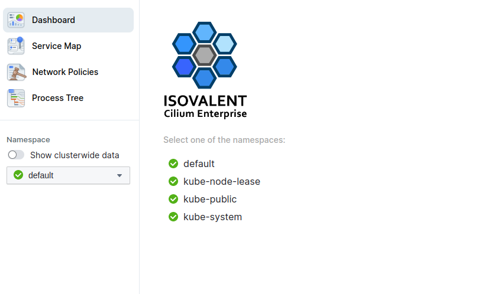
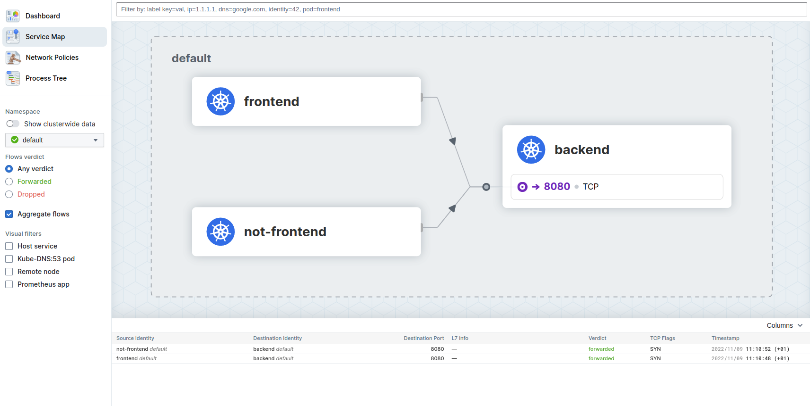

## {} Enable Hubble, Hubble Relay, and Hubble UI

Edit your `cilium-enterprise-values.yaml` file so that it reads:

```yaml
cilium:
  (...)
  extraConfig:
    # Disable Hubble flow export.
    export-file-path: ""
  hubble:
    enabled: true
    tls:
      enabled: true
    relay:
      enabled: true
  (...)
hubble-ui:
  enabled: true
```

Then, run helm upgrade command to apply the new configuration:

{}
Running the helm upgrade command below will restart Cilium daemonset.
{}

```bash
helm upgrade cilium-enterprise isovalent/cilium-enterprise --version 1.12.3+1 \
  --namespace kube-system -f cilium-enterprise-values.yaml --wait
```


## {}  Deploy a simple application

To accually see something with Hubble, we first deploy our `simple-app.yaml` from lab 03 again to run some experiments. Run the following command using the `simple-app.yaml` from lab 03:

```bash
kubectl apply -f simple-app.yaml
```

Now let us redo the task from lab 03.

Let's make life again a bit easier by storing the Pod's name into an environment variable so we can reuse it later again:

```bash
FRONTEND=$(kubectl get pods -l app=frontend -o jsonpath='{.items[0].metadata.name}')
echo ${FRONTEND}
NOT_FRONTEND=$(kubectl get pods -l app=not-frontend -o jsonpath='{.items[0].metadata.name}')
echo ${NOT_FRONTEND}
```

Then execute

```bash
kubectl exec -ti ${FRONTEND} -- curl -I --connect-timeout 5 backend:8080
```

and

```bash
kubectl exec -ti ${NOT_FRONTEND} -- curl -I --connect-timeout 5 backend:8080
```

You see that altought we have no `kube-proxy` running, the backend service can still be reached.

```
HTTP/1.1 200 OK
X-Powered-By: Express
Vary: Origin, Accept-Encoding
Access-Control-Allow-Credentials: true
Accept-Ranges: bytes
Cache-Control: public, max-age=0
Last-Modified: Sat, 26 Oct 1985 08:15:00 GMT
ETag: W/"83d-7438674ba0"
Content-Type: text/html; charset=UTF-8
Content-Length: 2109
Date: Tue, 14 Dec 2021 10:01:16 GMT
Connection: keep-alive

HTTP/1.1 200 OK
X-Powered-By: Express
Vary: Origin, Accept-Encoding
Access-Control-Allow-Credentials: true
Accept-Ranges: bytes
Cache-Control: public, max-age=0
Last-Modified: Sat, 26 Oct 1985 08:15:00 GMT
ETag: W/"83d-7438674ba0"
Content-Type: text/html; charset=UTF-8
Content-Length: 2109
Date: Tue, 14 Dec 2021 10:01:16 GMT
Connection: keep-alive
```


## {}  Access Hubble UI

To access Hubble UI, forward a local port to the Hubble UI service:

```
kubectl port-forward -n kube-system svc/hubble-ui 12000:80 & 
```

In our Webshell environment you can use the public IP of the VM to access Hubble. A simple way is to execute

```bash
echo "http://$(curl -s ifconfig.me):12000"
```
and copy the output in a new browser tab. If you are working locally, open your browser and go to http://localhost:12000/.



Select the `default` Namespace and go to Service Map:



You should see our already deployed simple app with the `frontend`, `notfrondend` and `backend` Pod.
