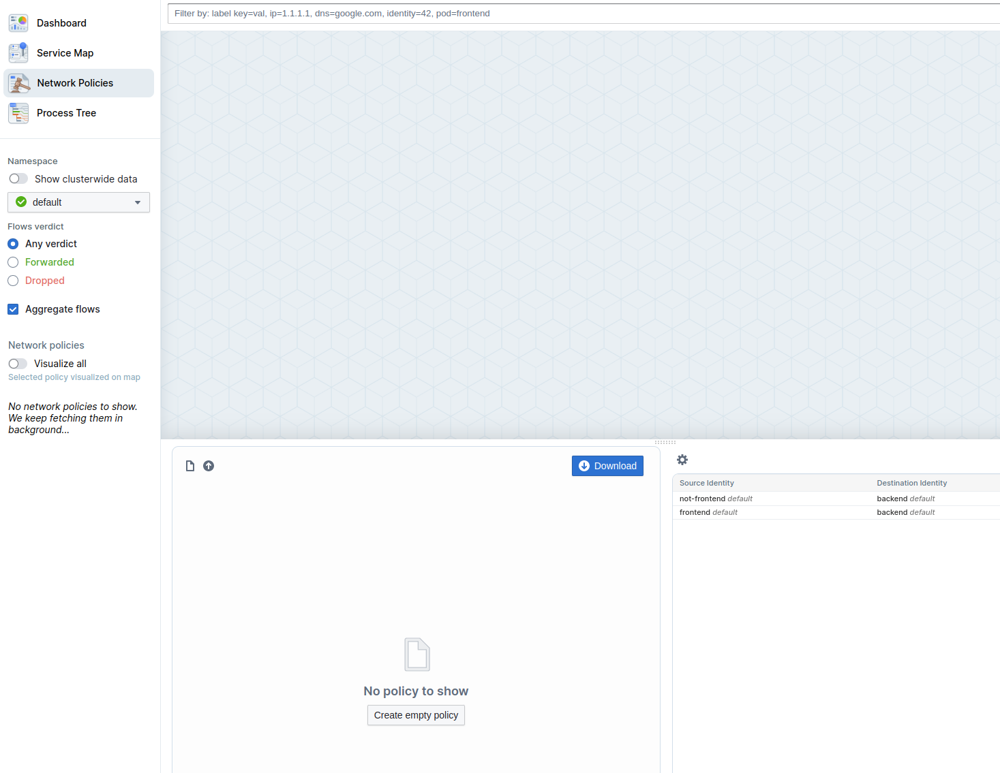
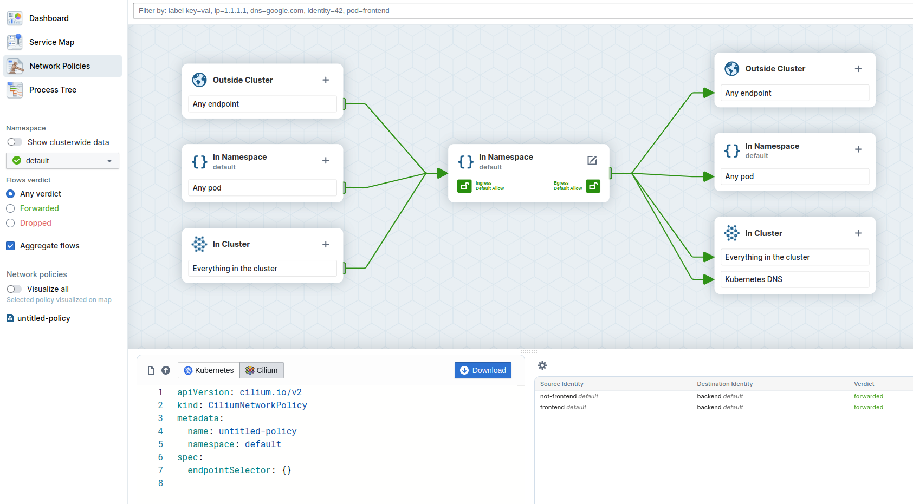
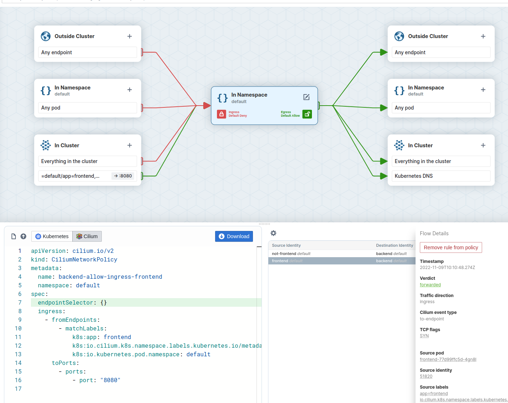
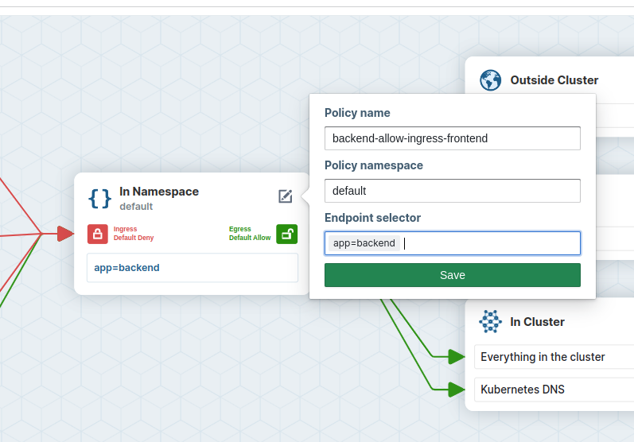
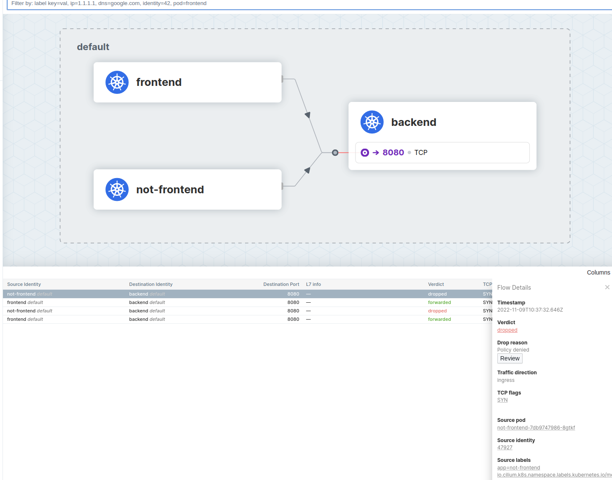

## {} Create a network policy with the Hubble UI

The Enterprise Hubble UI has an intergate Network Policy Editor similar to the one we already know from lab Cilium Network Policy. The Enterprise Network Policies Editor allows you to use knowlege of the current flows to easealy create new policies.

Go to `Network Policies`:




And the create a new empty policy:

.

We now want to allow traffic from the `frontend` pod to the `backend` pod while traffic from `not-frontend` to `backend` is blocked. In the right panel you the see existing flows. Select the flow from `frontend` to `backend` and then click on the `Add rule to policy` Button. The Network Policy Editor now visualice the policy.

.

Edit the Policy Name to `backend-allow-ingress-frontend` and also add `app=backend` as the endpoint selector:

.

Afterwards download the CiliumNetworkPolicy which should look like:




## {} Apply Network Policy

Apply the file with:

```bash
kubectl apply -f backend-allow-ingress-frontend.yaml
```

and then execute the connectivity test again:

```bash
kubectl exec -ti ${FRONTEND} -- curl -I --connect-timeout 5 backend:8080
```

and

```bash
kubectl exec -ti ${NOT_FRONTEND} -- curl -I --connect-timeout 5 backend:8080
```

And you see the `frontend` application is able to connect to the `backend` but the `not-frontend` application cannot connect to the `backend`:

```
# Frontend
HTTP/1.1 200 OK
X-Powered-By: Express
Vary: Origin, Accept-Encoding
Access-Control-Allow-Credentials: true
Accept-Ranges: bytes
Cache-Control: public, max-age=0
Last-Modified: Sat, 26 Oct 1985 08:15:00 GMT
ETag: W/"83d-7438674ba0"
Content-Type: text/html; charset=UTF-8
Content-Length: 2109
Date: Tue, 23 Nov 2021 13:08:27 GMT
Connection: keep-alive

# Not Frontend
curl: (28) Connection timed out after 5001 milliseconds
command terminated with exit code 28

```


## {}  Observe the Network Flows

In the Hubble UI Service map you see now some `dropped` flows.

.

By clicking on the `Review` button, the enterprise Hubble UI allows you to see which Network Policy was the reason for the `dropped` verdict.
